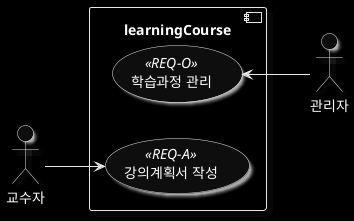
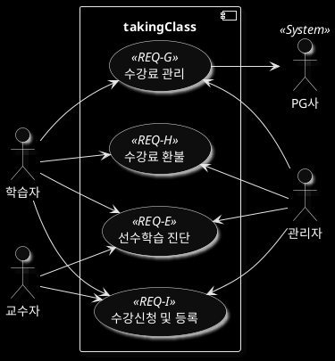
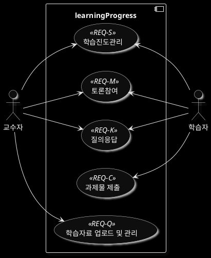
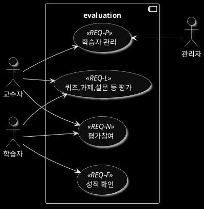
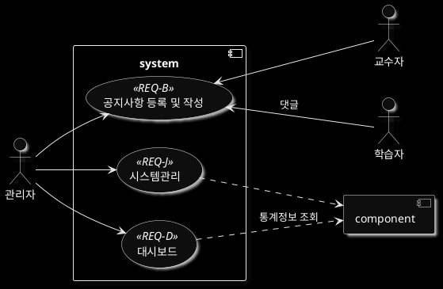
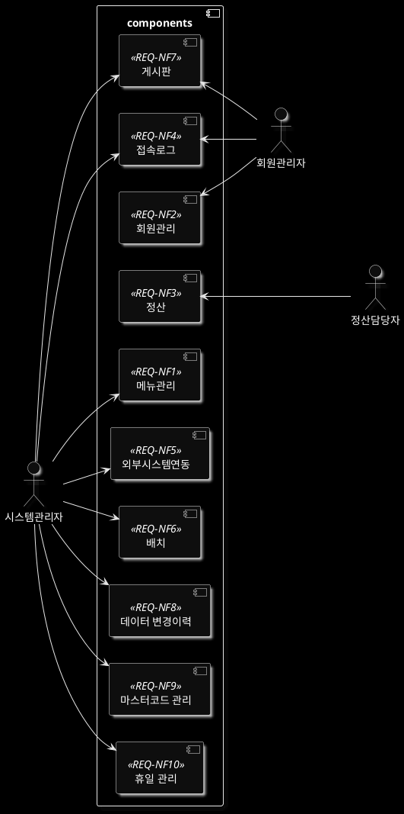
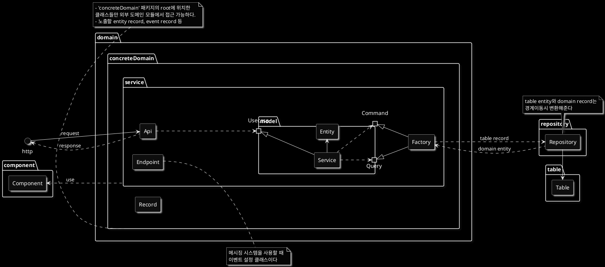

# Learning Management System

## 1 유스케이스

### 학습과정 

```plantuml
@startuml
skinparam monochrome reverse
skinparam shadowing true
left to right direction
:교수자: as professor
:관리자: as manager

component learningCourse {
    (강의계획서 작성) as req_a <<REQ-A>>
    (학습과정 관리) as req_o <<REQ-O>>

}
professor --> req_a
manager -up-> req_o
@enduml
```

### 수강 

```plantuml
@startuml
skinparam monochrome reverse
skinparam shadowing true
left to right direction
:학습자: as student
:교수자: as professor
:관리자: as manager
:PG사: as pg <<System>>

component takingClass {
    (수강신청 및 등록) as req_i <<REQ-I>>
    (선수학습 진단) as req_e <<REQ-E>>
    (수강료 관리) as req_g <<REQ-G>>
    (수강료 환불) as req_h <<REQ-H>>
}

manager -up-> req_i
manager -up-> req_e
manager -up-> req_g
manager -up-> req_h
professor --> req_i
professor --> req_e
student --> req_e
student --> req_g
student --> req_h
student --> req_i
req_g --> pg
@enduml
```

### 학습진도 

```plantuml
@startuml
skinparam monochrome reverse
skinparam shadowing true
left to right direction
:교수자: as professor
:학습자: as student

 component learningProgress {
        (과제물 제출) as req_c <<REQ-C>>
        (질의응답) as req_k <<REQ-K>>
        (토론참여) as req_m <<REQ-M>>
        (학습자료 업로드 및 관리) as req_q <<REQ-Q>>
        (학습진도관리) as req_s <<REQ-S>>
    }
professor --> req_k
professor --> req_m
professor --> req_q
professor --> req_s
student -up-> req_c
student -up-> req_k
student -up-> req_m
student -up-> req_s    
@enduml
```

### 평가 

```plantuml
@startuml
skinparam monochrome reverse
skinparam shadowing true
left to right direction
:교수자: as professor
:학습자: as student
:관리자: as manager

component evaluation {
    (성적 확인) as req_f <<REQ-F>>
    (퀴즈,과제,설문 등 평가) as req_l <<REQ-L>>
    (평가참여) as req_n <<REQ-N>>
    (학습자 관리) as req_p <<REQ-P>>
}

professor --> req_l
professor --> req_p
professor --> req_n
student --> req_f
student --> req_l
student --> req_n
manager -up-> req_p
@enduml
```

### 시스템 

```plantuml
@startuml
skinparam monochrome reverse
skinparam shadowing true
left to right direction
:교수자: as professor
:학습자: as student
:관리자: as manager
component system {
    (시스템관리) as req_j <<REQ-J>>
    (공지사항 등록 및 작성) as req_b <<REQ-B>>
    (대시보드) as req_d <<REQ-D>>
}

req_j ..> [component]
req_d ..> [component] : 통계정보 조회

professor -up-> req_b
student -up-> req_b : 댓글
manager --> req_j
manager --> req_d
manager --> req_b
@enduml
```

### 컴포넌트 

```plantuml
@startuml
skinparam monochrome reverse
skinparam shadowing true
left to right direction
component components {
    [메뉴관리] <<REQ-NF1>>
    [회원관리] <<REQ-NF2>>
    [정산] <<REQ-NF3>>
    [접속로그] <<REQ-NF4>>
    [외부시스템연동] <<REQ-NF5>>
    [배치] <<REQ-NF6>>
    [게시판] <<REQ-NF7>>
    [데이터 변경이력] <<REQ-NF8>>
    [마스터코드 관리] <<REQ-NF9>>
    [휴일 관리] <<REQ-NF10>>
}

:시스템관리자: --> [데이터 변경이력]
:시스템관리자: --> [메뉴관리]
:시스템관리자: --> [접속로그]
:시스템관리자: --> [외부시스템연동]
:시스템관리자: --> [배치]
:시스템관리자: --> [게시판]
:시스템관리자: --> [마스터코드 관리]
:시스템관리자: --> [휴일 관리]

:정산담당자: --up-> [정산]

:회원관리자: -up-> [회원관리]
:회원관리자: -up-> [접속로그]
:회원관리자: -up-> [게시판]

@enduml
```

## 2 모듈

```plantuml
@startuml
skinparam monochrome reverse
skinparam shadowing true
left to right direction

interface http

package repository {
    rectangle Repository
}

package table {
    rectangle Table
}

Repository -left-> Table

package component {
    rectangle Component
}

package domain {

    package concreteDomain {
        rectangle Record 

        package service {
            rectangle Api
            rectangle Factory
            rectangle Endpoint

            package model {
                portin Usecase
                portout Query
                portout Command

                rectangle Entity 
                rectangle Service 
            }
        }

        http --> Api: request
        http <.. Api: response
        Api ..> Usecase

        Usecase <|-- Service
        Service ..> Command
        Service ..> Query
        Service -left-> Entity

        Command <|-- Factory
        Query <|-- Factory
    }
}

service .up.> Component : use
Factory  ..> Repository : table record
Factory <.. Repository : domain entity


note bottom of concreteDomain
- 'concreteDomain' 패키지의 root에 위치한 
클래스들만 외부 도메인 모듈에서 접근 가능하다. 
- 노출할 entity record, event record 등
endnote
note right of Endpoint 
메시징 시스템을 사용할 때 
이벤트 설정 클래스이다
endnote
note bottom of Repository
table entity와 domain record는
경계이동시 변환해준다 
endnote
@enduml
```