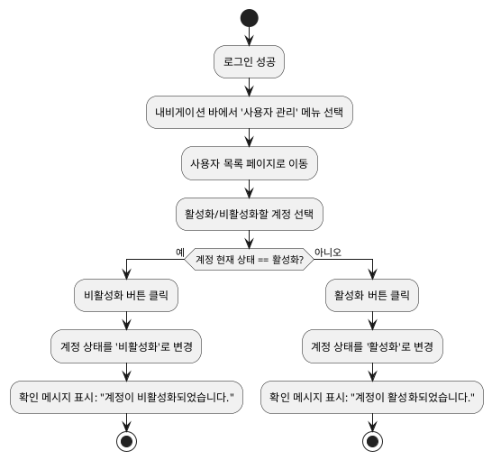

## 계정 활성화 / 비활성화 액티비티

```plantuml
@startuml
start
:로그인 성공;
:내비게이션 바에서 '사용자 관리' 메뉴 선택;
:사용자 목록 페이지로 이동;
:활성화/비활성화할 계정 선택;
if (계정 현재 상태 == 활성화?) then (예)
  :비활성화 버튼 클릭;
  :계정 상태를 '비활성화'로 변경;
  :확인 메시지 표시: "계정이 비활성화되었습니다.";
  stop
else (아니오)
  :활성화 버튼 클릭;
  :계정 상태를 '활성화'로 변경;
  :확인 메시지 표시: "계정이 활성화되었습니다.";
  stop
endif
@enduml
```