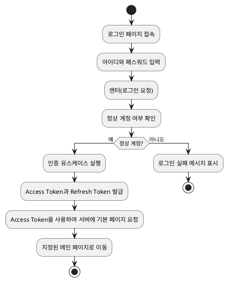

## 로그인 액티비티

```plantuml
@startuml
start
:로그인 페이지 접속;
:아이디와 패스워드 입력;
:엔터(로그인 요청);
:정상 계정 여부 확인;
if (정상 계정?) then (예)
  :인증 유스케이스 실행;
  :Access Token과 Refresh Token 발급;
  :Access Token을 사용하여 서버에 기본 페이지 요청;
  :지정된 메인 페이지로 이동;
  stop
else (아니오)
  :로그인 실패 메시지 표시;
  stop
endif
@enduml
```

- 정상 계정 여부 확인 엑션만 구현하고 나머지는 sign 컴포넌트에 위임
- access control 정보도 제공해주어야 함 Authority