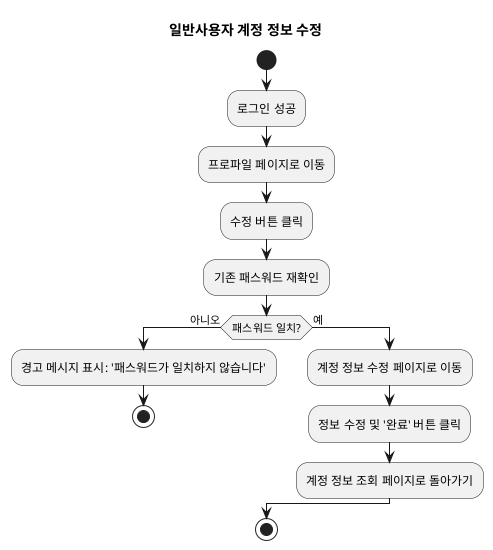
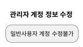

## 계정 정보 수정

### 일반 사용자

```plantuml
@startuml
title 일반사용자 계정 정보 수정
start
:로그인 성공;
:프로파일 페이지로 이동;
:수정 버튼 클릭;
:기존 패스워드 재확인;
if (패스워드 일치?) then (아니오)
  :경고 메시지 표시: '패스워드가 일치하지 않습니다';
  stop
else (예)
  :계정 정보 수정 페이지로 이동;
  :정보 수정 및 '완료' 버튼 클릭;
  :계정 정보 조회 페이지로 돌아가기;
endif
stop
@enduml
```

### 관리자

```plantuml
@startuml
title 관리자 계정 정보 수정
:일반사용자 계정 수정불가;
@enduml
```