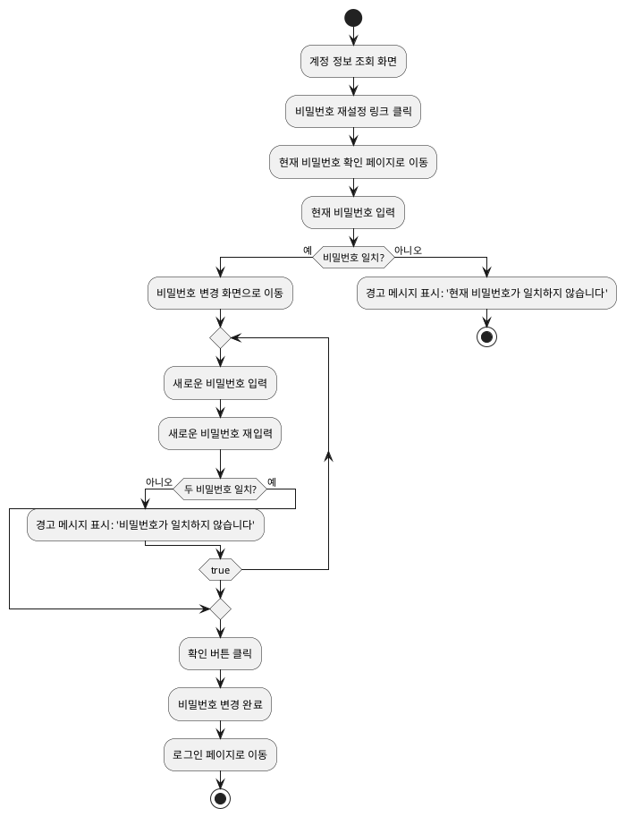

## 비밀번호 변경 액티비티

```plantuml
@startuml
start
:계정 정보 조회 화면;
:비밀번호 재설정 링크 클릭;
:현재 비밀번호 확인 페이지로 이동;
:현재 비밀번호 입력;

if (비밀번호 일치?) then (예)
  :비밀번호 변경 화면으로 이동;
  repeat
    :새로운 비밀번호 입력;
    :새로운 비밀번호 재입력;
    if (두 비밀번호 일치?) then (아니오)
      :경고 메시지 표시: '비밀번호가 일치하지 않습니다';
    else (예)
      break
    endif
  repeat while (true)
  :확인 버튼 클릭;
  :비밀번호 변경 완료;
  :로그인 페이지로 이동;
  stop
else (아니오)
  :경고 메시지 표시: '현재 비밀번호가 일치하지 않습니다';
  stop
endif

@enduml
```