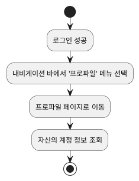
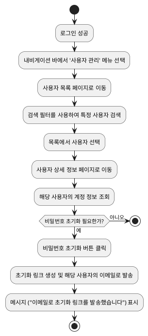

## 계정정보조회 액티비티

### 일반 사용자

```plantuml
@startuml
start
:로그인 성공;
:내비게이션 바에서 '프로파일' 메뉴 선택;
:프로파일 페이지로 이동;
:자신의 계정 정보 조회;
stop
@enduml
```

### 관리자

```plantuml
@startuml
|Admin|
start
:로그인 성공;
:내비게이션 바에서 '사용자 관리' 메뉴 선택;
:사용자 목록 페이지로 이동;
:검색 필터를 사용하여 특정 사용자 검색;
:목록에서 사용자 선택;
:사용자 상세 정보 페이지로 이동;
:해당 사용자의 계정 정보 조회;

if (비밀번호 초기화 필요한가?) then (예)
  :비밀번호 초기화 버튼 클릭;
  :초기화 링크 생성 및 해당 사용자의 이메일로 발송;
  :메시지 ("이메일로 초기화 링크를 발송했습니다") 표시;
  stop
else (아니오)
  stop
endif

@enduml
```