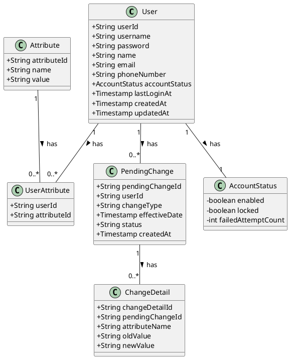
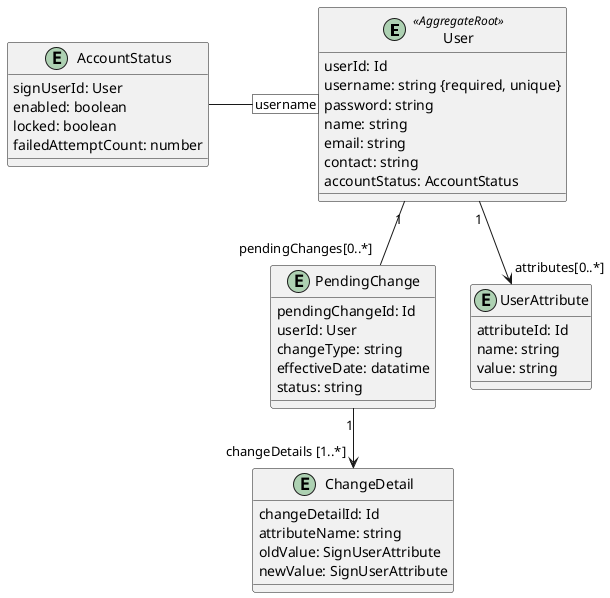

# 사용자 관리 시스템 클래스 다이어그램

## 설명
- User 클래스: 사용자 계정의 핵심 정보를 담고 있습니다. AccountStatus와는 1:1 관계를 가집니다. 이는 사용자의 계정 상태 정보가 User 객체의 일부임을 나타냅니다. UserAttribute 클래스와는 1:N 관계를 가집니다. 한 명의 사용자가 여러 개의 속성을 가질 수 있기 때문입니다.

- AccountStatus 클래스: 사용자의 계정 상태(활성화 여부, 잠금 여부, 로그인 실패 횟수 등)를 전문적으로 관리하는 별도의 클래스로 분리했습니다. 이렇게 하면 User 클래스가 더 간결해지고 상태 관리가 용이해집니다.

- Attribute 클래스: 부서, 직위와 같은 다양한 속성들을 정의하는 클래스입니다. UserAttribute와는 1:N 관계를 가집니다. 하나의 속성은 여러 사용자에게 부여될 수 있기 때문입니다.

- UserAttribute 클래스: User와 Attribute 간의 다대다(N:M) 관계를 연결하는 역할을 하는 중간 클래스입니다. 예를 들어, "김철수" 사용자가 "인사팀"과 "팀원"이라는 속성을 가질 때, 이 두 속성을 UserAttribute를 통해 연결합니다.

## 구현 모델 

