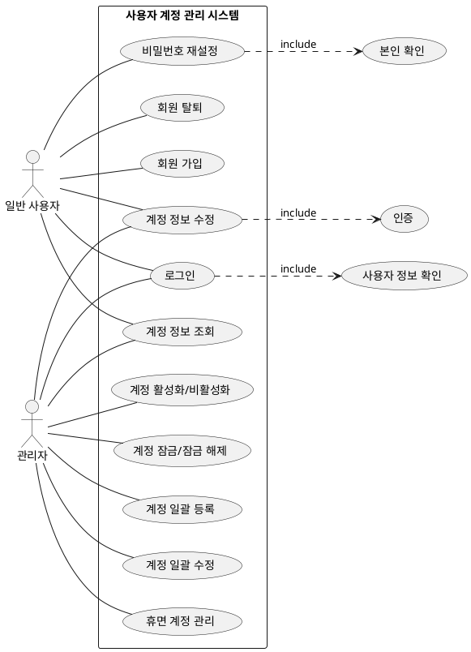

## 사용자 도메인 유스케이스

## 유스케이스별 액티비티 목록

- [로그인](./Login-activity.md)
- [회원가입](./Register-activity.md)
- [계정 정보 조회](./ViewInfo-activity.md)
- [계정 정보 수정](./ModifyInfo-activity.md)
- [비밀번호 재설정](./ResetPasssword-activity.md)
- [회원 탈퇴](./Withdraw-activity.md)
- [계정 활성화/비활성화](./Activate-activity.md)
- [계정 잠금 / 잠금해제](./Lock-activity.md)
- [계정 일괄 등록](./BatchRegister-activity.md)
- [계정 일괄 수정](./BatchUpdate-activity.md)
- [휴면 계정 관리](./Dormant-activity.md)