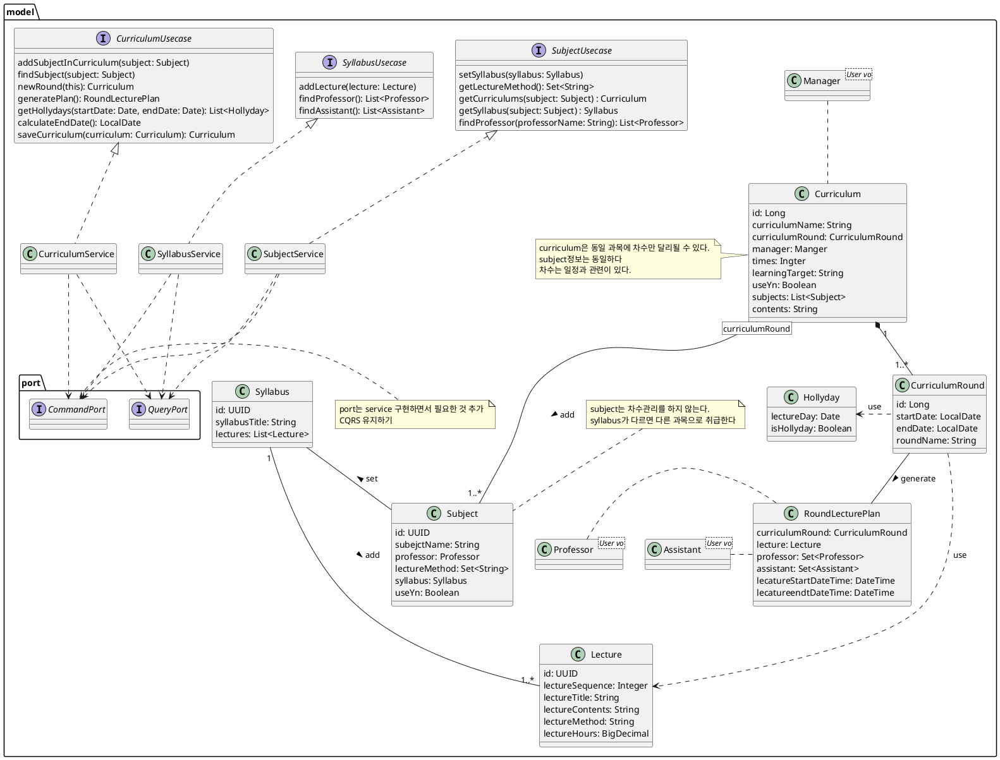

# 학습과정

## 모델

```plantuml
@startuml
package model {
    class Manager <User vo>
    '학습과정(커리큘럼)
    class Curriculum {
        id: Long
        curriculumName: String
        curriculumRound: CurriculumRound
        manager: Manger
        times: Ingter
        learningTarget: String
        useYn: Boolean
        subjects: List<Subject>
        contents: String 
    }
    note left 
        curriculum은 동일 과목에 차수만 달리될 수 있다. 
        subject정보는 동일하다
        차수는 일정과 관련이 있다. 
    end note
    
    Manager .. Curriculum
    
    class CurriculumRound {
        id: Long
        startDate: LocalDate
        endDate: LocalDate
        roundName: String
        
    }

    class RoundLecturePlan {
        curriculumRound: CurriculumRound
        lecture: Lecture
        professor: Set<Professor>
        assistant: Set<Assistant>
        lecatureStartDateTime: DateTime
        lecatureendtDateTime: DateTime
    }

    Curriculum "1" *-- "1..*" CurriculumRound
    CurriculumRound -- RoundLecturePlan : generate >
    CurriculumRound ...> Lecture : use
    CurriculumRound .left.> Hollyday : use

    class Hollyday {
        lectureDay: Date
        isHollyday: Boolean
    }
    '과목
    class Subject {
        id: UUID
        subejctName: String
        professor: Professor
        lectureMethod: Set<String>
        syllabus: Syllabus
        useYn: Boolean
        
    }
    note top
        subject는 차수관리를 하지 않는다. 
        syllabus가 다르면 다른 과목으로 취급한다
    end note
    '강의계획서
    class Syllabus  {
        id: UUID
        syllabusTitle: String
        lectures: List<Lecture>
        
    }
    class Lecture {
        id: UUID
        lectureSequence: Integer
        lectureTitle: String
        lectureContents: String
        lectureMethod: String
        lectureHours: BigDecimal
        
    }

    class Professor <User vo> 
    class Assistant <User vo>

    Curriculum [curriculumRound] --- "1..*" Subject : add >
    Subject -left- Syllabus : set >
    Syllabus "1" --- "1..*" Lecture : add >
    RoundLecturePlan .left. Professor
    RoundLecturePlan .left. Assistant

    interface CurriculumUsecase {
        addSubjectInCurriculum(subject: Subject)
        findSubject(subject: Subject)
        newRound(this): Curriculum
        generatePlan(): RoundLecturePlan
        getHollydays(startDate: Date, endDate: Date): List<Hollyday>
        calculateEndDate(): LocalDate
        saveCurriculum(curriculum: Curriculum): Curriculum
    }

    interface SubjectUsecase {
        setSyllabus(syllabus: Syllabus)
        getLectureMethod(): Set<String>
        getCurriculums(subject: Subject) : Curriculum
        getSyllabus(subject: Subject) : Syllabus
        findProfessor(professorName: String): List<Professor>
    }

    interface SyllabusUsecase {
        addLecture(lecture: Lecture)
        findProfessor(): List<Professor>
        findAssistant(): List<Assistant>
    }

    class CurriculumService  
    class SubjectService
    class SyllabusService

    CurriculumUsecase <|.. CurriculumService
    SubjectUsecase <|.. SubjectService 
    SyllabusUsecase <|.. SyllabusService 

    package port {
        interface QueryPort
        interface CommandPort
    }
    note left 
        port는 service 구현하면서 필요한 것 추가 
        CQRS 유지하기 
    end note

    CurriculumService ..> QueryPort  
    SubjectService ..> QueryPort
    SyllabusService ..> QueryPort
    CurriculumService ..> CommandPort  
    SubjectService ..> CommandPort
    SyllabusService ..> CommandPort
}
@enduml
```

    

