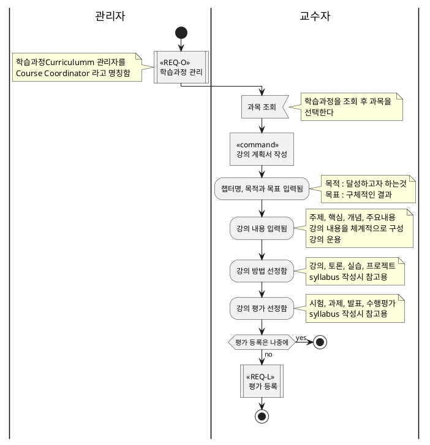
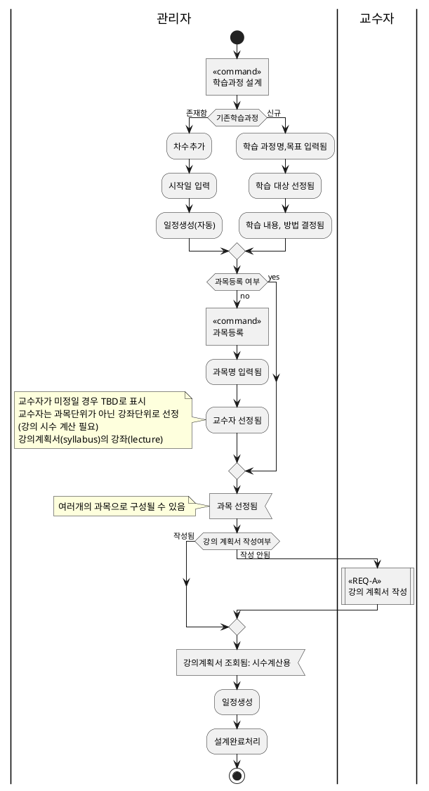

# 학습과정 

## 프로세스

### REQ-A 강의계획서 작성

```plantuml
@startuml

|관리자|
start
:<<REQ-O>>\n학습과정 관리|
note 
    학습과정Curriculumm 관리자를
    Course Coordinator 라고 명칭함 
end note
|교수자|
:과목 조회<
note right 
    학습과정을 조회 후 과목을 
    선택한다
end note
:<<command>>\n강의 계획서 작성]
:챕터명, 목적과 목표 입력됨;
note right
    목적 : 달성하고자 하는것
    목표 : 구체적인 결과
end note
:강의 내용 입력됨;
note right
    주제, 핵심, 개념, 주요내용
    강의 내용을 체계적으로 구성
    강의 운용 
end note
:강의 방법 선정함;
note right
    강의, 토론, 실습, 프로젝트
    syllabus 작성시 참고용 
end note
:강의 평가 선정함;
note right
    시험, 과제, 발표, 수행평가
    syllabus 작성시 참고용
end note
if (평가 등록은 나중에) then (yes)
stop
else (no)
:<<REQ-L>>\n 평가 등록|

stop
@enduml
```

### REQ-O 학습과정 관리

```plantuml
@startuml
|관리자|
start
:<<command>>\n학습과정 설계]
if (기존학습과정) then (존재함)
    :차수추가;
    :시작일 입력;
    :일정생성(자동);
else (신규)
    :학습 과정명,목표 입력됨;
    :학습 대상 선정됨;
    :학습 내용, 방법 결정됨;
end if

if (과목등록 여부) then (yes)
else (no)
    |관리자|
    :<<command>>\n과목등록]
    :과목명 입력됨;
    :교수자 선정됨;
    note left
        교수자가 미정일 경우 TBD로 표시
        교수자는 과목단위가 아닌 강좌단위로 선정 
        (강의 시수 계산 필요)
        강의계획서(syllabus)의 강좌(lecture)
end note
end if 
:과목 선정됨<
    note left
        여러개의 과목으로 구성될 수 있음
    end note
if (강의 계획서 작성여부) then (작성됨)
else (작성 안됨)
    |교수자|
    :<<REQ-A>>\n강의 계획서 작성|
end if
|관리자|
:강의계획서 조회됨: 시수계산용<
:일정생성;
:설계완료처리;
stop

@enduml
```

