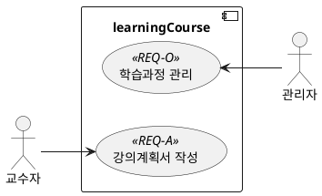

# 학습과정 

## 유스케이스

```plantuml
@startuml
left to right direction
:교수자: as professor
:관리자: as manager

component learningCourse {
    (강의계획서 작성) as req_a <<REQ-A>>
    (학습과정 관리) as req_o <<REQ-O>>

}
professor --> req_a
manager -up-> req_o
@enduml
```
